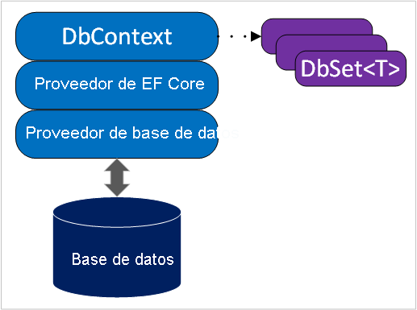

# Conservación y recuperación de datos relacionales con Entity Framework Core

Asignadores de objetos relacionales "object-relational mappers" (ORM) y Entity Framework (EF) Core. Usará EF Core para conservar y recuperar datos relacionales de una base de datos.

Ampliación del servicio API web de RESTful como requisito previo para el escaparate web y la aplicación móvil de la empresa; el admitirá la adición, visualización, modificación y eliminación de tipos de pizza en la base de datos de la empresa. Estas cuatro operaciones se conocen a menudo como **C**reación, **L**ectura, **A**ctualización y **E**liminación (CRUD, por sus siglas en inglés).

# Descripción de EF Core


Entity Framework Core es un **asignador de objetos relacionales**. Los ORM "object-relational mappers" proporcionan una capa entre el modelo de dominio que se implementa en el código y la base de datos. EF Core es una API de acceso a datos que permite interactuar con la base de datos mediante POCO (**o**bjeto **C**LR **e**stándar) de .NET y LINQ fuertemente tipado. Esto le permite dedicar menos tiempo a traducir solicitudes hacia y desde la base de datos y a escribir SQL, por lo que puede disponer de más tiempo para centrarse en una lógica de negocios importante.

## Revisión de la arquitectura de EF Core

En el diagrama siguiente se muestra la arquitectura subyacente a EF Core.



## Administración de esquemas de base de datos

### Migraciones (modelo como origen de confianza)

### Técnicas de ingeniería inversa (base de datos como origen de confianza)

# Ejercicio: Migraciones

## Adición de paquetes NuGet y herramientas de EF Core

```c#
dotnet add package Microsoft.EntityFrameworkCore.Sqlite
```

```
dotnet add package Microsoft.EntityFrameworkCore.Design
```

```
dotnet tool install --global dotnet-ef
```

## Conexión de modelos y DbContext

Directorio Data, creación PizzaContext.cs

```c#
using Microsoft.EntityFrameworkCore;
using ContosoPizza.Models;

namespace ContosoPizza.Data;

public class PizzaContext : DbContext
{
    public PizzaContext (DbContextOptions<PizzaContext> options)
        : base(options)
    {
    }

    public DbSet<Pizza> Pizzas => Set<Pizza>();
    public DbSet<Topping> Toppings => Set<Topping>();
    public DbSet<Sauce> Sauces => Set<Sauce>();
}
```

Directorio Models, creación de Sauce.cs y Toppins.cs

## 

```c#
namespace ContosoPizza.Models;

public class Sauce
{
    public int Id { get; set; }

    public string? Name { get; set; }
}
```


```c#
namespace ContosoPizza.Models;

public class Topping
{
    public int Id { get; set; }
    public string? Name { get; set; }
}
```


Updating Program.cs

```c#
using ContosoPizza.Data;
var builder = WebApplication.CreateBuilder(args);

// Add services to the container.

builder.Services.AddControllers();
// Learn more about configuring Swagger/OpenAPI at https://aka.ms/aspnetcore/swashbuckle
builder.Services.AddEndpointsApiExplorer();
builder.Services.AddSwaggerGen();
builder.Services.AddSqlite<PizzaContext>("Data Source=ContosoPizza.db");

var app = builder.Build();


// Configure the HTTP request pipeline.
if (app.Environment.IsDevelopment())
{
    app.UseSwagger();
    app.UseSwaggerUI();
}

app.UseHttpsRedirection();

app.UseAuthorization();

app.MapControllers();

app.Run();

```

## Creación y ejecución de una migración

```
dotnet ef migrations add InitialCreate --context PizzaContext
```

```
dotnet ef database update --context PizzaContext
```

## Inspección de la base de datos

Uso de la extension SQLLite para ver la BBDD

Uso de SQLite Explorer

## Cambio del modelo y actualización del esquema de base de datos

Actualizar Pizza

```c#
using System.ComponentModel.DataAnnotations;

namespace ContosoPizza.Models;

public class Pizza
{
    public int Id { get; set; }

    [Required]
    [MaxLength(100)]
    public string? Name { get; set; }

    public Sauce? Sauce { get; set; }

    public ICollection<Topping>? Toppings { get; set; }
}
```

Actualizar Sauce.cs

```c#
using System.ComponentModel.DataAnnotations;

namespace ContosoPizza.Models;

public class Sauce
{
    public int Id { get; set; }

    [Required]
    [MaxLength(100)]
    public string? Name { get; set; }

    public bool IsVegan { get; set; }
}
```

Actualización de Toppings.cs

```c#
using System.ComponentModel.DataAnnotations;
using System.Text.Json.Serialization;

namespace ContosoPizza.Models;

public class Topping
{
    public int Id { get; set; }

    [Required]
    [MaxLength(100)]
    public string? Name { get; set; }

    public decimal Calories { get; set; }

    [JsonIgnore]
    public ICollection<Pizza>? Pizzas { get; set; }
}
```

Generar una migración

```
dotnet ef migrations add ModelRevisions --context PizzaContext
```

Aplicar la migración para actualizar la estructura de la BBDD

```
dotnet ef database update --context PizzaContext
```


# Ejercicio: Interacción con datos


## Métodos CRUD

Actualizar PizzaServices (Quitar static A la class)

```c#
using ContosoPizza.Models;
using ContosoPizza.Data;
using Microsoft.EntityFrameworkCore;

namespace ContosoPizza.Services;

public class PizzaService
{
    private readonly PizzaContext _context;

    public PizzaService(PizzaContext context)
    {
        _context = context;
    }

    /// ...
    /// CRUD operations removed for brevity
    /// ...
}
```


Reemplazar GetAll

```c#
public IEnumerable<Pizza> GetAll()
{
    return _context.Pizzas
        .AsNoTracking()
        .ToList();
}
```

Reemplazar GetByID

```c#
public Pizza? GetById(int id)
{
    return _context.Pizzas
        .Include(p => p.Toppings)
        .Include(p => p.Sauce)
        .AsNoTracking()
        .SingleOrDefault(p => p.Id == id);
}
```

Reemplace Add

```c#
public Pizza Create(Pizza newPizza)
{
    _context.Pizzas.Add(newPizza);
    _context.SaveChanges();

    return newPizza;
}
```

Insertar el método UpdateSauce

```c#
public void UpdateSauce(int PizzaId, int SauceId)
{
    var pizzaToUpdate = _context.Pizzas.Find(PizzaId);
    var sauceToUpdate = _context.Sauces.Find(SauceId);

    if (pizzaToUpdate is null || sauceToUpdate is null)
    {
        throw new NullReferenceException("Pizza or sauce does not exist");
    }

    pizzaToUpdate.Sauce = sauceToUpdate;

    _context.SaveChanges();
}
```

Añadir AddTopping

```c#
public void AddTopping(int PizzaId, int ToppingId)
    {
        var pizzaToUpdate = _context.Pizzas.Find(PizzaId);
        var toppingToAdd = _context.Toppings.Find(ToppingId);

        if (pizzaToUpdate is null || toppingToAdd is null)
        {
            throw new NullReferenceException("Pizza or topping does not exist");
        }

        if (pizzaToUpdate.Toppings is null)
        {
            pizzaToUpdate.Toppings = new List<Topping>();
        }

        pizzaToUpdate.Toppings.Add(toppingToAdd);

        _context.Pizzas.Update(pizzaToUpdate);
        _context.SaveChanges();
    }
```


Actualizar Delete

```c#
public void DeleteById(int id)
{
    var pizzaToDelete = _context.Pizzas.Find(id);
    if (pizzaToDelete is not null)
    {
        _context.Pizzas.Remove(pizzaToDelete);
        _context.SaveChanges();
    }        
}
```

## Propagación de la base de datos

Añadir en Data el fichero DBinitializer.cs

```c#
using ContosoPizza.Models;

namespace ContosoPizza.Data
{
    public static class DbInitializer
    {
        public static void Initialize(PizzaContext context)
        {

            if (context.Pizzas.Any()
                && context.Toppings.Any()
                && context.Sauces.Any())
            {
                return;   // DB has been seeded
            }

            var pepperoniTopping = new Topping { Name = "Pepperoni", Calories = 130 };
            var sausageTopping = new Topping { Name = "Sausage", Calories = 100 };
            var hamTopping = new Topping { Name = "Ham", Calories = 70 };
            var chickenTopping = new Topping { Name = "Chicken", Calories = 50 };
            var pineappleTopping = new Topping { Name = "Pineapple", Calories = 75 };

            var tomatoSauce = new Sauce { Name = "Tomato", IsVegan = true };
            var alfredoSauce = new Sauce { Name = "Alfredo", IsVegan = false };

            var pizzas = new Pizza[]
            {
                new Pizza
                    { 
                        Name = "Meat Lovers", 
                        Sauce = tomatoSauce, 
                        Toppings = new List<Topping>
                            {
                                pepperoniTopping, 
                                sausageTopping, 
                                hamTopping, 
                                chickenTopping
                            }
                    },
                new Pizza
                    { 
                        Name = "Hawaiian", 
                        Sauce = tomatoSauce, 
                        Toppings = new List<Topping>
                            {
                                pineappleTopping, 
                                hamTopping
                            }
                    },
                new Pizza
                    { 
                        Name="Alfredo Chicken", 
                        Sauce = alfredoSauce, 
                        Toppings = new List<Topping>
                            {
                                chickenTopping
                            }
                        }
            };

            context.Pizzas.AddRange(pizzas);
            context.SaveChanges();
        }
    }
}
```


Añadir en data el fichero Extensions.cs

```c#
namespace ContosoPizza.Data;

public static class Extensions
{
    public static void CreateDbIfNotExists(this IHost host)
    {
        {
            using (var scope = host.Services.CreateScope())
            {
                var services = scope.ServiceProvider;
                var context = services.GetRequiredService<PizzaContext>();
                if (context.Database.EnsureCreated())
                {
                    // Starting here  DbInitializer.Initialize(context);
                    // But the data are not initialized, then move out of here
                }    
                DbInitializer.Initialize(context);
            }
        }
    }
}
```

Actualizar en Program.cs

```c#
app.CreateDbIfNotExists();
```


## Ejecución de la aplicación y conexión

Instalar o actualizar httprepl

```
dotnet tool install -g Microsoft.dotnet-httprepl
```

Ejecutar el APIRestful

```
dotnet run --urls=https://localhost:5101
```

Configurar el httprepl

```
notepad C:\Users\billy\.httpreplprefs
```

añadir el siguiente contenido

```
editor.command.default=C:\Windows\System32\notepad.exe
```

Salvar el fichero

Entrar a httprepl

```
httprepl https://localhost:5101
```

Ejecutar el siguiente commando para establecer sincronia entre el editor y el httprepl

```
pref set editor.command.default.arguments "-w"
```


## Prueba de las operaciones de la base de datos

Enumerar los puntos de conexión detectados:

```
ls
```

Cambiar el punto de conexión a Pizza

```
cd Pizza
```

Ejecutar el get para obtener todas las pizzas

```
get
```

Obtener 1 unica pizza

```
get 2
```

Agregar una nueva pizza

```
post
```

Cuando se abra el NotePad inserte el siguiente código, guardelo y cierre el notepad

```
{
  "name": "BBQ Beef",
  "sauce": {
    "name": "BBQ",
    "isVegan": false
  },
  "toppings": [
    {
      "name": "Smoked Beef Brisket",
      "calories": 250
    }
  ]
}
```

Agregar otro ingrediente

```
put 4/addtopping?toppingId=5 --no-body
```

Recuperar la Pizza con id 4

```
get 4
```

Borrar la pizza 4

```
delete 4
```

Salga de httprepl

``` 
exit
```

> Sugerencia

> Puede experimentar con la aplicación como desee. Siempre que quiera empezar con una base de datos nueva, detenga la aplicación y elimine los archivos *ContosoPizza.db*, *.db-shm* y *.db-wal* y, a continuación, vuelva a ejecutar la aplicación.

Excelente trabajo! La aplicación funciona con la base de datos según lo previsto. En la siguiente unidad, realizará scaffolding en los modelos de entidad desde una base de datos existente.

# Ejercicio: Técnicas de ingeniería inversa

## Inspección de la base de datos de promociones

1. En el panel **EXPLORADOR**, haga clic con el botón derecho en el archivo *Promotions/Promotions.db* y seleccione **Abrir base de datos**.
2. En el panel **EXPLORADOR DE SQLITE**, expanda los nodos *Promotions.db* y *Coupons*. Observe el esquema de datos.
3. Haga clic con el botón derecho en el nodo *Coupons* y seleccione **Mostrar tabla**. Inspeccione los datos del cupón.

## Aplique scaffolding al contexto de las promociones y al modelo de cupón

1. Ejecute el comando siguiente:

   CLI de .NETCopiar

   ```dotnetcli
   dotnet ef dbcontext scaffold "Data Source=.\Promotions\Promotions.db" Microsoft.EntityFrameworkCore.Sqlite --context-dir .\Data --output-dir .\Models 
   ```

## Adición de un punto de conexión de cupón

Aggregar el controlador de cupones en la carpeta Controller *CouponController.cs*

```c#
using ContosoPizza.Data;
using ContosoPizza.Models;
using Microsoft.AspNetCore.Mvc;
using Microsoft.EntityFrameworkCore;

namespace ContosoPizza.Controllers;

[ApiController]
[Route("[controller]")]
public class CouponController : ControllerBase
{
    PromotionsContext _context;

    public CouponController(PromotionsContext context)
    {
        _context = context;
    }

    [HttpGet]
    public IEnumerable<Coupon> Get()
    {
        return _context.Coupons
            .AsNoTracking()
            .ToList();
    }
}
```

En *Program.cs*, reemplace el comentario `// Add the PromotionsContext` por el código siguiente:

```csharp
builder.Services.AddSqlite<PromotionsContext>("Data Source=./Promotions/Promotions.db"));
```

Guarde todos los cambios y ejecute la aplicación.

```dotnetcli
dotnet run --urls=https://localhost:5101
```

## Prueba del punto de conexión

1. En otro terminal, ejecute el comando de HttpRepl.

   ```dotnetcli
   httprepl https://localhost:5101
   ```

2. Cambie al punto de conexión `Coupon`.

   ```dotnetcli
   cd Coupon
   ```

3. Recupere los cupones de la base de datos.

   ```dotnetcli
   get
   ```

   Tenga en cuenta que `expiration` es datetime.

# Resumen

En este módulo, ha usado Entity Framework Core para conservar los datos en una base de datos. Puede aplicar estas mismas aptitudes a otros proveedores de bases de datos de EF Core, como SQL Server y PostgreSQL.
